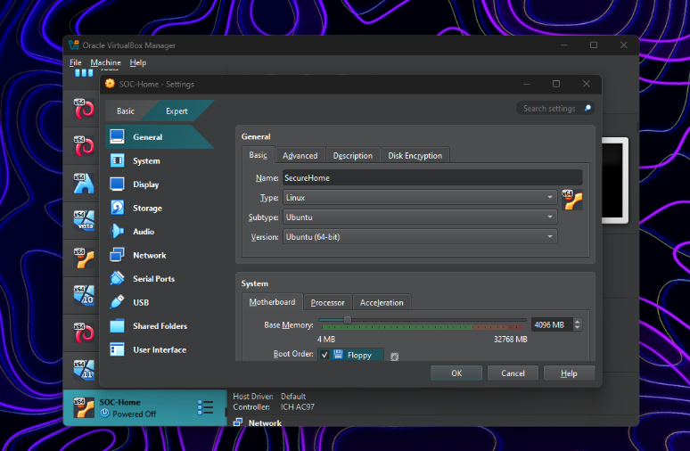
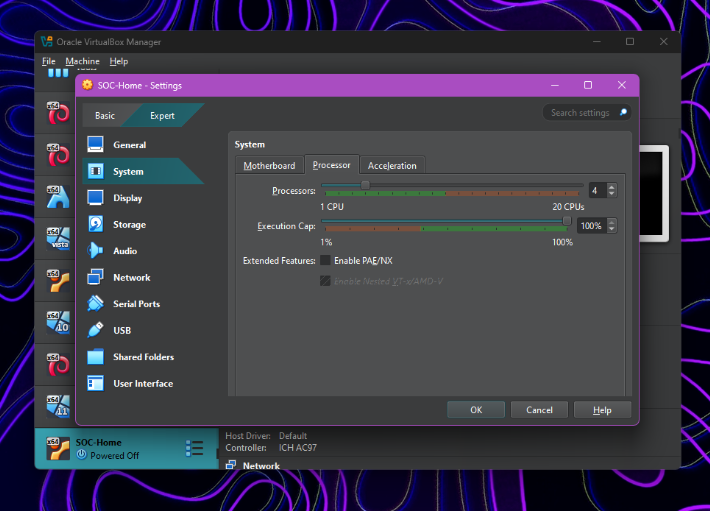
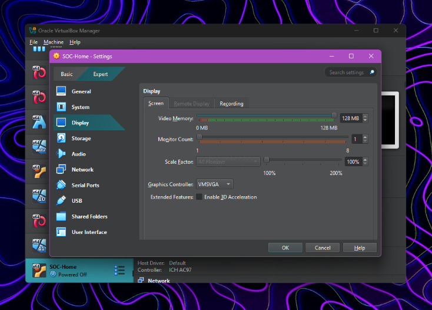
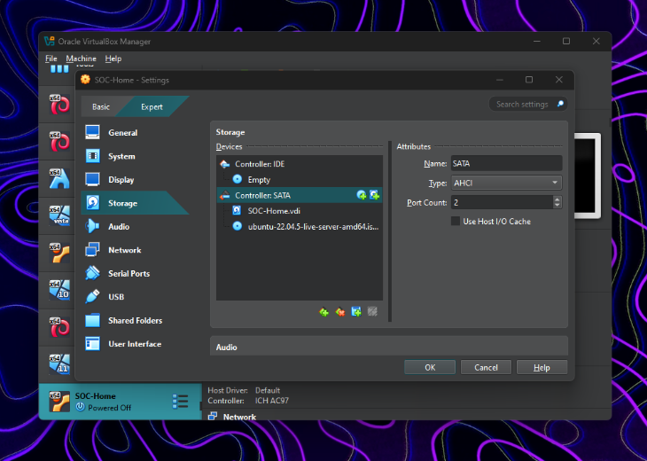
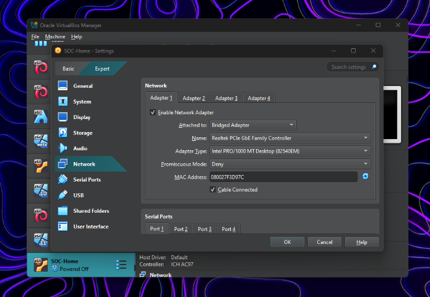

# SecureHome Lab - Wazuh SIEM Setup

## Architecture Overview


**Note**: Replace `192.168.1.44` with your actual server IP address throughout this guide.

## Lab Environment

- **Host Platform**: VirtualBox
- **Server OS**: Ubuntu 22.04.5 LTS Server
- **Agent OS**: Windows with EDR capabilities
- **Wazuh Version**: 4.12.0

## Prerequisites

### Ubuntu Server Requirements
- **RAM**: Minimum 4GB (8GB recommended)
- **Storage**: 50GB minimum
- **CPU**: 2 cores minimum
- **Network**: Connectivity required

### Windows Agent Requirements
- **OS**: Any supported Windows version
- **Network**: Connectivity to Wazuh Manager
- **Access**: Administrator privileges

### VM Configuration Example
- **Hostname**: `wazuh-server`
- **Username**: `qays`
- **ISO**: [`ubuntu-22.04.5-live-server-amd64.iso`](https://releases.ubuntu.com/jammy/)


---

## VirtualBox Setup

### Resource Allocation
Configure your VM with adequate resources:

* VM Resources


* RAM Configuration


* CPU


* Display settings


* Sorage


* Network Configuration


### Initial Server Setup
```bash
sudo apt update && sudo apt upgrade -y
sudo apt install -y net-tools curl git
ip addr show
```

---

## Installation Guide

### Phase 1: Wazuh Server Installation

#### Step 1: Download Installation Files
```bash
curl -sO https://packages.wazuh.com/4.12/wazuh-install.sh
curl -sO https://packages.wazuh.com/4.12/config.yml
```

#### Step 2: Get Server IP Address
```bash
ip addr show
```

#### Step 3: Configure Installation File
```bash
nano config.yml
```

Update with your server IP:
```yaml
nodes:
  indexer:
    - name: node-1
      ip: "192.168.1.44"
  server:
    - name: wazuh-1
      ip: "192.168.1.44"
  dashboard:
    - name: dashboard
      ip: "192.168.1.44"
```

#### Step 4: Verify System Resources
```bash
free -h  # Check RAM
df -h    # Check disk space
```

#### Step 5: Generate Security Certificates
```bash
sudo bash wazuh-install.sh --generate-config-files
```

#### Step 6: Install All Components
```bash
sudo bash wazuh-install.sh --all-in-one
```

**Installation Notes:**
- Process takes approximately 15 minutes
- UFW firewall warning expected
- Save admin credentials from output

#### Step 7: Configure Firewall
```bash
sudo ufw allow 1515/tcp  # Agent communication
sudo ufw allow 1514/tcp  # Agent data
sudo ufw allow 443/tcp   # Web interface
sudo ufw reload
```

#### Step 8: Verify Service Status
```bash
sudo systemctl status wazuh-manager
sudo systemctl status wazuh-indexer
sudo systemctl status wazuh-dashboard
sudo systemctl status filebeat
```

#### Step 9: Access Dashboard
1. Navigate to: `https://192.168.1.44:443`
2. Accept self-signed certificate
3. Login with installation credentials

**Default Credentials:**
```
Username: admin
Password: yy+kseVU0Ktn0032QXQYVTSo1g8Ee5YN
```

---

### Phase 2: Windows Agent Deployment

#### Step 1: Obtain Agent Installer
1. Access Wazuh Dashboard
2. Navigate to **Server Management > Endpoints Summary**
3. Click **Add Agent**
4. Select **Windows** platform
5. Configure:
   - Server IP: `192.168.1.44`
   - Agent Name: `Windows-Agent`
6. Copy installation command

#### Step 2: Install Agent
Run in PowerShell as Administrator:
```powershell
Invoke-WebRequest -Uri https://packages.wazuh.com/4.x/windows/wazuh-agent-4.12.0-1.msi -OutFile $env:tmp\wazuh-agent; msiexec.exe /i $env:tmp\wazuh-agent /q WAZUH_MANAGER='192.168.1.44' WAZUH_AGENT_GROUP='default' WAZUH_AGENT_NAME='Windows-Agent'
```

#### Step 3: Start Agent Service
```cmd
NET START WazuhSvc
```

#### Step 4: Verify Connection
Check server for agent registration:
```bash
sudo /var/ossec/bin/agent_control -l
```

### Troubleshooting Agent Connection

#### Network Connectivity Issues
Test connection from Windows:
```powershell
Test-NetConnection -ComputerName 192.168.1.44 -Port 1514
```

#### Windows Firewall Configuration
```powershell
New-NetFirewallRule -DisplayName "Wazuh Agent" -Direction Outbound -Protocol TCP -RemotePort 1514,1515 -Action Allow
```

#### Ubuntu Firewall Verification
```bash
sudo ufw allow 1514/tcp
sudo ufw allow 1515/tcp
sudo ufw reload
```

#### Agent Service Management
```cmd
NET STOP WazuhSvc
NET START WazuhSvc
```

---

### Phase 3: EDR Configuration

#### Step 1: Install Sysmon
Download and configure Sysmon for enhanced monitoring:
```powershell
Invoke-WebRequest -Uri https://download.sysinternals.com/files/Sysmon.zip -OutFile $env:tmp\Sysmon.zip
Expand-Archive $env:tmp\Sysmon.zip $env:tmp\Sysmon
cd $env:tmp\Sysmon
.\sysmon64.exe -accepteula -i -n -l -h md5,sha256
```

#### Step 2: Configure Agent Monitoring
Create enhanced monitoring configuration:
```bash
sudo nano /var/ossec/etc/shared/default/agent.conf
```

Add monitoring configuration:
```xml
<agent_config>
  <localfile>
    <location>Microsoft-Windows-Sysmon/Operational</location>
    <log_format>eventchannel</log_format>
  </localfile>
  
  <localfile>
    <location>Microsoft-Windows-PowerShell/Operational</location>
    <log_format>eventchannel</log_format>
  </localfile>
  
  <localfile>
    <location>Security</location>
    <log_format>eventchannel</log_format>
    <query>Event/System[EventID=4688 or EventID=4689 or EventID=4624 or EventID=4625 or EventID=4648 or EventID=4768]</query>
  </localfile>
</agent_config>
```

#### Step 3: Apply Configuration
```bash
sudo systemctl restart wazuh-manager
```

#### Step 4: Update Agent
```cmd
NET STOP WazuhSvc
NET START WazuhSvc
```

---

## Testing and Validation

### Dashboard Verification
1. Access **Security Events** section
2. Monitor **Agents** status
3. Review **Vulnerability Detection**
4. Test **File Integrity Monitoring**

### Event Generation Testing
- Execute PowerShell commands
- Create/modify files in monitored directories
- Install/uninstall applications
- Monitor network connections

### Log Analysis
Monitor real-time events:
```bash
sudo tail -f /var/ossec/logs/ossec.log
```

---

## Maintenance and Operations

### Service Management
Check service status:
```bash
sudo systemctl status wazuh-manager wazuh-indexer wazuh-dashboard filebeat
```

### Agent Management
List all agents:
```bash
sudo /var/ossec/bin/agent_control -l
```


### System Recovery
After VM restart, verify all services are running. Most components auto-start, but manual intervention may be needed if:
- IP addresses change
- Services fail startup order
- Memory constraints cause issues
- Time synchronization problems occur

### Performance Monitoring
Monitor system resources:
```bash
htop
df -h
free -h
```

---

## Security Considerations

- Change default admin password
- Configure SSL certificates properly
- Implement network segmentation
- Regular backup of configuration
- Monitor system performance
- Update Wazuh components regularly

This lab provides a comprehensive SIEM solution with EDR capabilities for learning security operations, threat hunting, and incident response in a controlled environment.